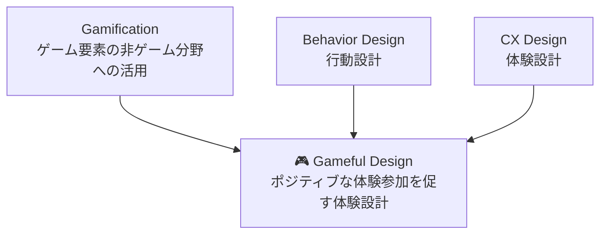
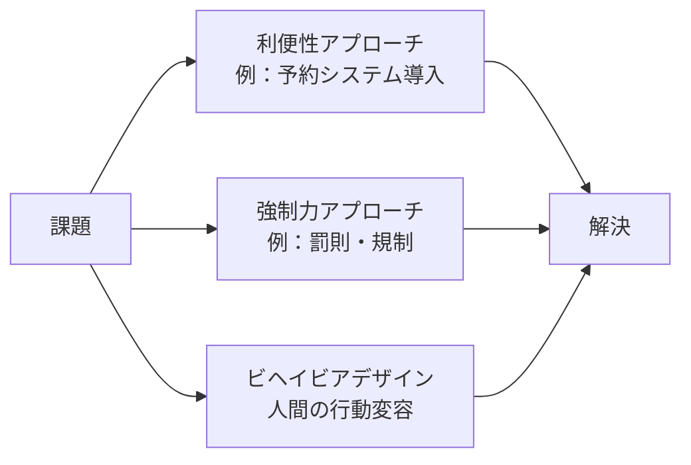
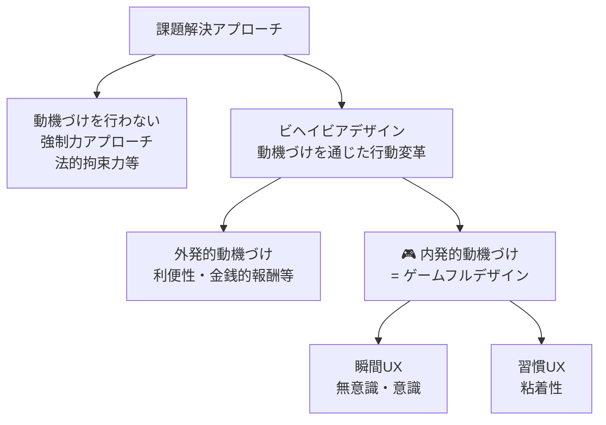
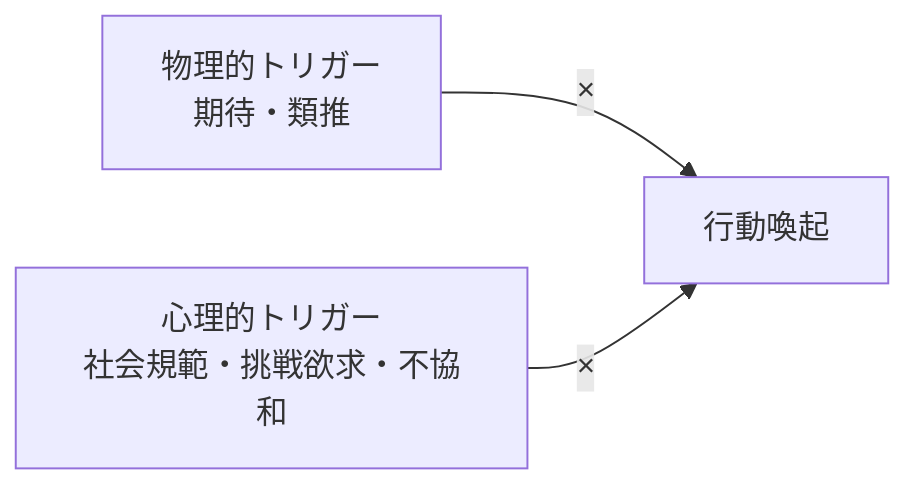
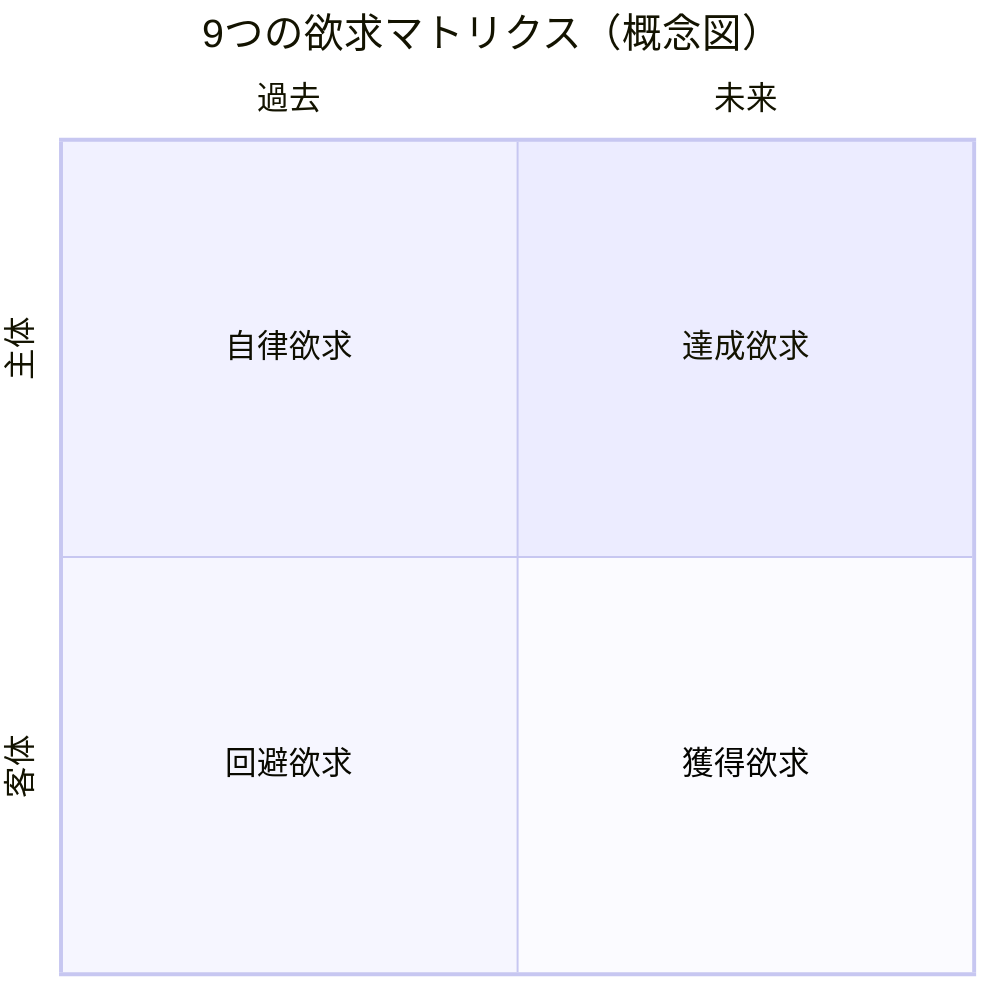
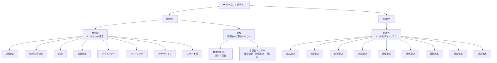

# ゲームフルデザイン まとめ

> 出典：[ゲームフルデザイン概要](https://segaxd.co.jp/gamefuldesign/overview/) / [SEGA XD独自メソッド](https://segaxd.co.jp/gamefuldesign/method/)（株式会社セガ エックスディー）

---

## 目次

1. [ゲームフルデザインとは](#1-ゲームフルデザインとは)
   - 1-1 ゲーミフィケーションとの違い
   - 1-2 ゲームフルデザインが内包する価値
2. [SEGA XD独自メソッド](#2-sega-xd独自メソッド)
   - 2-1 ビヘイビアデザイン
   - 2-2 課題解決アプローチの整理
   - 2-3 瞬間UX【無意識】8つの要素
   - 2-4 瞬間UX【意識】5つの要素
   - 2-5 習慣UX【粘着性】9つの欲求
   - 2-6 不得意な領域
   - 2-7 CXのあいうえお® / 課題解決クエスト

---

## 1. ゲームフルデザインとは

> **一言定義：** 内発的な動機づけを通じた「ついやってしまう」「ついやりたくなってしまう」「ついやり続けたくなってしまう」仕掛けを活用して課題を解決する体験設計アプローチ。

### 1-1 ゲーミフィケーションとの違い

| | ゲーミフィケーション | ゲームフルデザイン |
|---|---|---|
| **定義** | ゲーム要素の非ゲーム分野への応用 | ゲーム要素を応用した体験設計 |
| **焦点** | バッジ・レベル・リワードなどの手法論 | 人間の内発的動機づけを引き出す体験 |
| **関係性** | 上位概念 | ゲーミフィケーションに内包される |
| **位置づけ** | CXデザイン・ビヘイビアデザインの一手法 | 同左（より体験設計寄り） |



### 1-2 ゲームフルデザインが内包する価値

- 人間の **内発的動機** に働きかける体験設計アプローチ
- 金銭的価値の追求や強制なしに、**自発的・能動的な行動変容** を促す
- 行動の変化を通じて課題を解決し、社会の幸福度を高めることを目指す
- ゲーム・エンタテインメントの「ついやってしまう」仕掛けを非ゲーム領域に転用

---

## 2. SEGA XD独自メソッド

### 2-1 ビヘイビアデザイン

課題解決のアプローチは大きく3種類に分類される。



**ビヘイビアデザインの特徴：**
- 「してしまう」「したくなる」内的要素 × それを喚起する外的要素 をセットで考える
- 罰則などの強制なしに、自然な行動として目的を達成させる
- 例：行列に紐を張る → 自然と整列する / 音量計測モニター設置 → 自然と静かになる

---

### 2-2 課題解決アプローチの整理



---

### 2-3 瞬間UX【無意識】— 8つの「ついやってしまう」要素

**ベース概念：ナッジ**（行動科学の知見を用いて、人々が望ましい行動を自発的にとれるよう手助けする手法）

| # | 要素 | 概要 |
|---|---|---|
| 1 | **初期設定** | 予め望ましい状態をデフォルトにしておくことで選択させる |
| 2 | **単純化 / 容易化** | 手続きや書類作成を簡単にすることで多くの人に選択させる |
| 3 | **同期** | 他の多くの人がやっていることを「すべき」と感じさせる |
| 4 | **情報開示** | 選択肢のメリットを開示して選択させる |
| 5 | **リマインダー** | 期日や約束を少し前に知らせることで行動を促す |
| 6 | **フレーミング** | 情報を適切に整理して望ましい選択をさせる |
| 7 | **わかりやすさ** | グラフィック・図示などを用いて注意を引き行動を促す |
| 8 | **エラー予測** | 取りうる間違いの選択肢を予想し、予め取らないよう対処する |

**「いい発想」の判断基準：**
```
意外性 × 共感性
= 「思いつかなかったけど、言われてみたら確かにそう」と感じられるアイデア
```

---

### 2-4 瞬間UX【意識】— 5つの「ついやりたくなってしまう」要素

人間の行動フロー：**外発的刺激（物理的トリガー）→ 感情（心理的トリガー）→ 行動**

| トリガー種別 | 要素 | 概要 |
|---|---|---|
| **物理的トリガー**（見た目・モノの形） | 期待 | 見た目から反応・効果が予想できる |
| **物理的トリガー** | 類推 | 見たことがあり、どう使うかがわかる |
| **心理的トリガー**（心に湧き起こる感情） | 社会規範 | 社会通念上「やらないといけない」と感じさせる |
| **心理的トリガー** | 挑戦欲求 | やってみたい・チャレンジしてみたいと感じさせる |
| **心理的トリガー** | 不協和 | 揃っていないことを気持ち悪いと感じさせる |



**例：足跡マーク（ソーシャルディスタンス）**
- 期待（物理）：「ここに立てばいい」と予想できる
- 社会規範（心理）：「自分だけ和を乱すわけにはいかない」と感じる
→ 自然と足跡の上に立つ行動が生まれる

---

### 2-5 習慣UX【粘着性】— 9つの「ついやり続けてしまう」欲求

欲求は **環境軸（主体・状況・客体）** × **時間軸（未来・現在・過去）** の3×3マトリクスで整理される。



| | 未来 | 現在 | 過去 |
|---|---|---|---|
| **主体** | 🏆 **達成欲求**<br>進歩実感による動機づけ | 💡 **有能欲求**<br>創造性の発揮・能力の実感 | 🔑 **自律欲求**<br>自分事化・使命感・特別扱い |
| **状況** | 🔍 **求知欲求**<br>偶然性・好奇心・不確実性への探求 | 🎨 **感性欲求**<br>美しさ・気持ちよさなど生理的快感 | 👥 **関係欲求**<br>他者を意識・周囲から良く見られたい |
| **客体** | 💎 **獲得欲求**<br>希少性・限定品・特別能力 | 🏠 **保存欲求**<br>愛着・一貫性・未完成を完成させたい | ⚠️ **回避欲求**<br>損失回避・連続損失・取り残され感 |

**各欲求へのアプローチ例：**

| 欲求 | アプローチ例 |
|---|---|
| 達成欲求 | 相対的進歩表現、非連続成長の可視化 |
| 有能欲求 | ルール明示、ポジティブフィードバック |
| 自律欲求 | 所属意識と仮想枠、特別扱いと理解者のコミュニケーション |
| 求知欲求 | 不確実性トッピング、ランダムビジュアライズ |
| 感性欲求 | 視覚的インパクト、アート的魅力 |
| 関係欲求 | 社会的規範とトレンド、ドナースペースと社交場 |
| 獲得欲求 | レアリティ定義とビジュアライズ、供給制限と獲得可能性制限 |
| 保存欲求 | セルフビルドとアレンジ、コミットメント |
| 回避欲求 | 連続損失とサンクスレス訴求、取り残され感と横取り恐怖 |

---

### 2-6 ゲームフルデザインが不得意な領域

> 「ゲームフルデザイン」は、本質的な人間の欲求を理解した上で欲求を刺激し行動を変容することであり、結果的に課題を解決するアプローチ。**人が介在しない領域は不得意。**

- **不得意な例：** 完全自動化された工場内でのマシンの稼働効率化
- **理由：** 人間の行動が課題解決に介在しない状況では機能しない

---

### 2-7 SEGA XD独自メソッド

#### CXのあいうえお®
ゲームフルデザインを実現するオリジナルメソッド。CX領域の課題に対して「ついやってしまう」「ついやりたくなってしまう」「ついやり続けてしまう」を体系的に実現するフレームワーク。

#### 課題解決クエスト
画期的なアウトプットを引き出す1ヶ月伴走型のアイデア創出支援プログラム。ゲームの発想法で課題に対して最適なワークショップを実施し、「心動かすアイデア」の創出を支援。

---

## 全体構造まとめ


